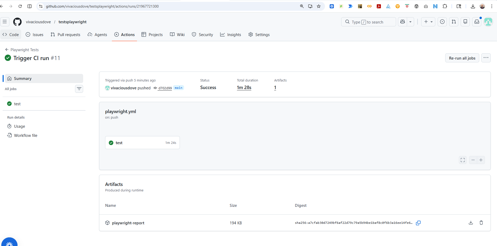

[](https://github.com/vivaciousdove/testsplaywright/actions)

# 🧪 Playwright CI UI Testing — Cloud Status Dashboard

**TL;DR**
- Playwright UI tests running **headlessly in CI**
- **Cross-browser** coverage: Chromium, Firefox, WebKit
- **Evidence-first**: HTML report, traces, screenshots, videos
- GitHub Actions pipeline with **always-uploaded artifacts**

---

## 📌 Project Overview
This repository demonstrates a **production-style UI automation pipeline** using **Playwright** (Microsoft, 2020) and **GitHub Actions** (GitHub CI/CD platform).

The system under test is a deterministic **Cloud Status Dashboard** designed for repeatable validation.

The focus is not just passing tests — **it’s verifiable proof reviewers can inspect.**

Sources  
Playwright: https://en.wikipedia.org/wiki/Playwright_(software)  
GitHub Actions: https://docs.github.com/actions

---

## 🎯 What This Proves
- Tests run reliably in CI  
- Evidence captured on pass **and** fail  
- Cross-browser risk understood  
- QA treated as a **delivery system**

---

## 🧰 Stack
- **Playwright** — browser automation
::contentReference[oaicite:0]{index=0}
 + assertions  
- **TypeScript** — typed test code  
- **GitHub Actions** — CI execution  
- **HTML Reporter** — human-readable report  
- **Trace Viewer** — step-by-step replay

---

## 🧪 Test Coverage
- Page load validation  
- Cloud provider cards (AWS/Azure/GCP)  
- Status indicators + timestamps  
- User interaction and UI updates  
- Cross-browser consistency

---

## ⚙️ CI Pipeline Contract

**Triggers**
- Runs on push to `main`

**Pipeline Steps**
1. Install dependencies + browsers  
2. Execute tests headlessly across browsers  
3. Generate HTML report  
4. Capture traces, screenshots, videos  
5. Upload artifacts **even if tests fail**

**Artifacts Produced**
- `playwright-report/`
- `test-results/`
- traces/videos/screenshots

---

## 📍 Where to See Proof (2 Clicks)

1. Actions → Playwright Tests → latest run  
2. Download **playwright-report** artifact  
3. Open `index.html` locally

---

## 🖼️ CI Run Example

Example successful GitHub Actions run producing Playwright artifacts:




---

## 📁 Repo Evidence (Static Samples)

- `evidence/html-reports`
- `evidence/traces`
- `evidence/ui-screenshots`

---

## 🔗 System Under Test
https://vivaciousdove.github.io/cloud-status-dashboard/

---

## 🧑‍💻 Run Locally

```bash
npm ci
npx playwright install --with-deps
npx playwright test
npx playwright show-report
